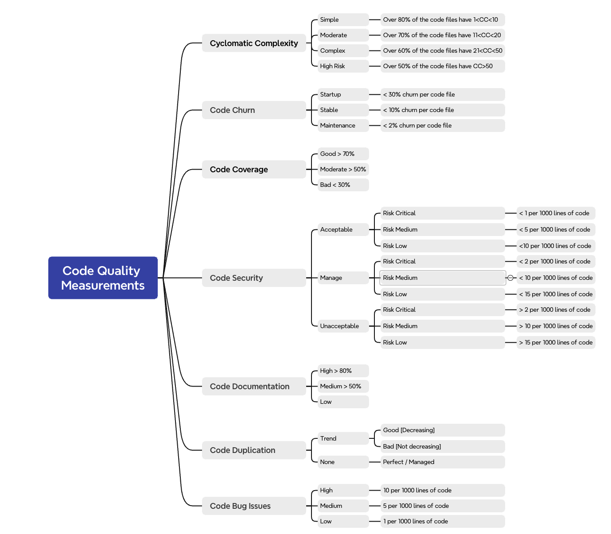
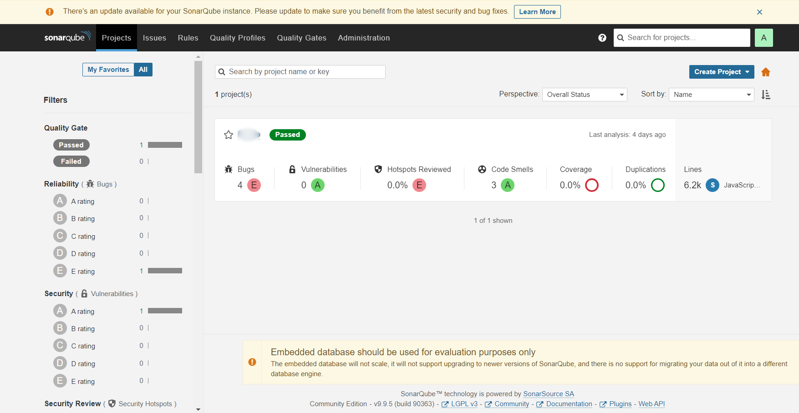

# Code Quality Analysis

## How to Run the Script
- Place the .xlsx or .csv files inside the input directory.
- Run the script using `python main.py`.
- Summary reports will be created inside the input folder appending the `-summary` to the input name of the file. 

## SonarQube Overview

### Main Rules
- Code smell (maintainability domain) 
- Bug (reliability domain) 
- Vulnerability (security domain) 
- Security hotspot (security domain) 

https://docs.sonarsource.com/sonarqube/9.9/user-guide/rules/overview/

### Code Quality Measures from Reports



- From the given reports, Code Security and Code Bug Issues can be separated directly. 
- Code Churn and Code Documentation cannot be measured from the given reports. (Can use Jacoco to observe Code Coverage: https://github.com/tkgregory/sonarqube-jacoco-code-coverage/tree/master)  
- For the remaining, CODE_SMELL can be categorized to Cyclomatic Complexity, Code Documentation and Code Duplication. 
- One way to do this is to get the rule IDs from the reports and divide them into the above categories through a script. A python script was written to do this job. 
- Since it’s a tedious process as the rule ids are not known before the execution, keyword search was implemented. For Code Bugs, there’s a separate column in the .xlsx files named as ‘type’ and if it’s a BUG, it will be considered for Code Bug Issues. 
```
keyword_categories = { 
    "Cyclomatic Complexity": ["cognitive", "cyclomatic"], 
    "Code Documentation": [], 
    "Code Duplication": ["duplicate", "duplicates"], 
    "Code Churn": [], 
    "Code Coverage": [], 
    "Code Security": [], 
}
```
- Code Security keywords are not mentioned in there as there’s a separate sheet for that. Python script was implemented to go through if the file type is .xlsx. 
- But when the file type is .csv (in dotnet projects there’s a separate .csv with a .xlsx) there’s no Security Hotspots sheet and a ‘type’ column in the sheet to differentiate BUGS and Code Smells. They will be missing the summary report if the .csv file is used in dotnet projects. 
- Severity mapping was done in the below way (taken from severity in the reports) as there isn’t a generic way as in the above figure to categorize it, 
```
severity_mapping = { 
    "Cyclomatic Complexity": { 
        "CRITICAL": "High Risk", 
        "BLOCKER": "High Risk", 
        "MAJOR": "Complex", 
        "DEFAULT": "Moderate" 
    }, 
    "Code Security": { 
        "CRITICAL": "Unacceptable", 
        "BLOCKER": "Unacceptable", 
        "MAJOR": "Manage", 
        "DEFAULT": "Acceptable" 
    }, 
    "Code Duplication": { 
        "CRITICAL": "High", 
        "BLOCKER": "High", 
        "MAJOR": "Medium", 
        "DEFAULT": "Low" 
    }, 
    "Code Bug Issues": { 
        "CRITICAL": "High", 
        "BLOCKER": "High", 
        "MAJOR": "Medium", 
        "DEFAULT": "Low" 
    } 
} 
```
- After running the script, the .xslx file is created in the same directory by appending ‘-summary’ to the input file name to view the summary of the project.


### Code Quality Measures using SonarQube Server 
- Once the PHR-Code Analysis script is finished, we can go to http://localhost:9000 and view the summary of the code quality (including Code coverage, duplications, security and vulnerabilities) of the specified project.  



- This is an alternative to observe the same results in a detailed manner. 
- Since it can be viewed only locally, one solution for this is to configure a centralized url in the PHR script to view it from anywhere. 
- SonarQube can be deployed in an EC2 instance to create a centralized server. 
- Steps:     
```
Launch a new EC2 instance by configuring security groups (allowing inbound traffic on port 9000). 
Installing Docker on the EC2 instance. 
Deploy SonarQube using Docker. 
Configure security groups and accessibility. 
Configure SonarQube with required credentials. 
Update local projects to use centralized SonarQube by changing the host url in the sonar-project.properties file. 
View the results in the hosted url. 
```